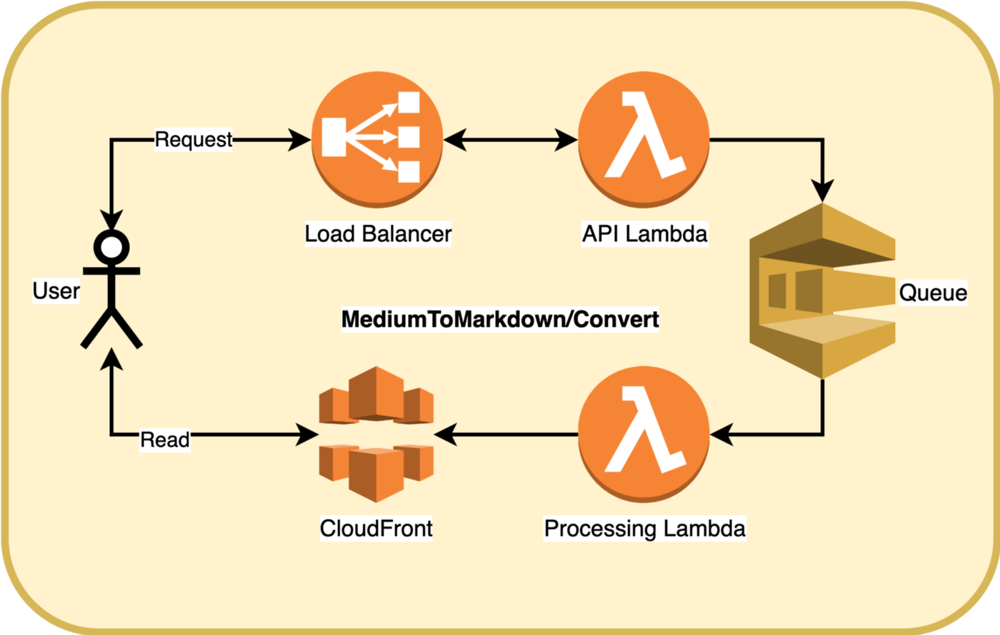

# [T3chFlicks](https://t3chflicks.org): Medium To MarkDown
> This is an investigation into giving away free APIs on AWS with the example of a service which converts Medium articles to MarkDown.

> # [🤖 The Service Landing Page Can Be Found Here 🤖](https://medium-to-markdown.t3chflicks.org)

## Architecture

## Read The Blog Post

## Try The Service
You can access this service on the [T3chFlicks site](https://t3chflicks.org/Services/medium-to-markdown).

Or, you can run the service locally using the [medium-to-markdown script](./src/processing/utils.py).

## Contribution
Please contribute to this project by improving the script, or by reporting issues with the performance.

---

This project was created by [T3chFlicks](https://t3chflicks.org) - A tech focused education and services company.

---